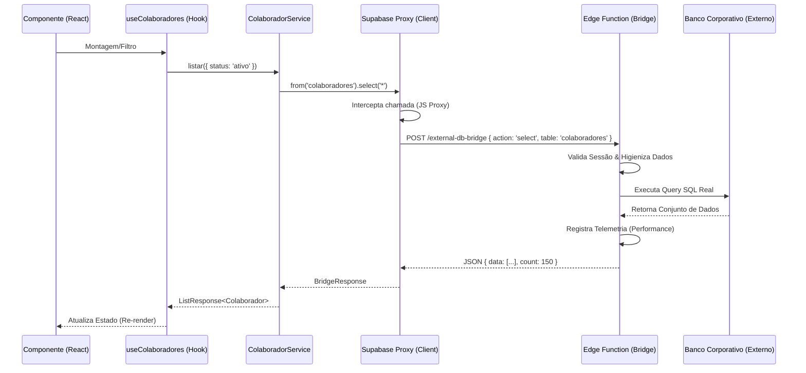

# Arquitetura e Fluxo de Dados - RH ERP

Este documento descreve a arquitetura técnica da aplicação, focando na integração customizada entre o Frontend e o Banco de Dados Corporativo Externo.

## 1. Visão Geral da Arquitetura

A aplicação utiliza uma arquitetura baseada em **React (Vite)** com **TypeScript**, organizada em camadas para separação de preocupações:

- **Frontend (UI):** Componentes React + Tailwind CSS (Shadcn UI).
- **Hooks:** Orquestração de estado e cache (TanStack Query).
- **Services:** Abstração de regras de negócio e chamadas de dados.
- **Bridge (Edge Function):** Gateway que traduz comandos do frontend para o banco corporativo.

## 2. Diagrama de Sequência: Fluxo de Dados



## 3. Estrutura de Pastas

| Pasta | Responsabilidade |
| :--- | :--- |
| `src/pages/` | Definição de rotas e layouts de alto nível. |
| `src/components/` | UI Reutilizável (Botões, Cards, Modais). |
| `src/hooks/` | Estado da UI e orquestração de dados via React Query. |
| `src/services/` | Comunicação com API e abstração de tabelas. Estende `BaseService`. |
| `src/integrations/` | Configurações do Supabase e o `dbBridgeProxy`. |

## 4. Contrato da Edge Function `external-db-bridge`

A Edge Function intercepta requisições do frontend para garantir telemetria e compatibilidade de schema.

### Requisição (POST)
- `action`: `'select' | 'insert' | 'update' | 'delete' | 'rpc' | 'upsert'`
- `table`: Nome da tabela alvo.
- `filters`: Array de objetos `{ column, op, value }`.
- `data`: Dados para operações de escrita.
- `limit/offset`: Parâmetros de paginação.

### Resposta
- `data`: Dados retornados do banco.
- `count`: Total de registros (quando solicitado).
- `duration_ms`: Tempo de resposta do banco externo.

## 5. Diretrizes para Desenvolvedores

1. **Nunca use o cliente Supabase original:** Sempre importe o `supabase` de `@/integrations/supabase/client` para garantir que a chamada passe pelo Proxy.
2. **Use o BaseService:** Ao criar um novo serviço, estenda `BaseService<T>` para herdar funcionalidades de CRUD automaticamente.
3. **Tipagem:** Embora o Proxy use `any` internamente para flexibilidade de schema, sempre tipagem as interfaces de retorno nos Hooks e Componentes.
## 6. Padrões Obrigatórios (External DB Bridge)

Para manter a integridade do sistema e a visibilidade de performance, novos desenvolvedores devem seguir estes padrões ao interagir com o `external-db-bridge`:

### Exemplo de Chamada de Consulta (Select)
```typescript
const { data, error, count } = await supabase
  .from('colaboradores')
  .select('id, nome_completo', { count: 'exact' })
  .eq('status', 'ativo')
  .range(0, 9);
```
**Payload gerado internamente:**
```json
{
  "action": "select",
  "table": "colaboradores",
  "columns": "id, nome_completo",
  "filters": [{ "column": "status", "op": "eq", "value": "ativo" }],
  "limit": 10,
  "offset": 0,
  "countMode": "exact"
}
```

### Tratamento de Erros Padronizado
O Bridge retorna erros estruturados. O cliente em `client.ts` já lida com a exibição de toasts para erros de conexão, mas erros de lógica de negócio ou schema devem ser tratados no `Service`:

```typescript
if (error) {
  // O Bridge retornará 400 se a coluna não existir no banco corporativo
  console.error("Erro de Schema:", error.message);
  throw error;
}
```

### Telemetria e Performance
- Consultas que demoram mais de **3000ms** são marcadas como `SLOW` nos logs da Edge Function.
- Consultas que demoram mais de **8000ms** são marcadas como `VERY_SLOW`.
- Evite `select('*')` em tabelas com muitas colunas (ex: `colaboradores`) para reduzir o payload e tempo de resposta.

## 7. Scripts de Validação
O projeto conta com um script de fumaça (smoke test) para validar a integridade do Bridge:
- `bun run test:bridge`: Valida se a Edge Function está respondendo corretamente e se os contratos de request/response permanecem íntegros.
